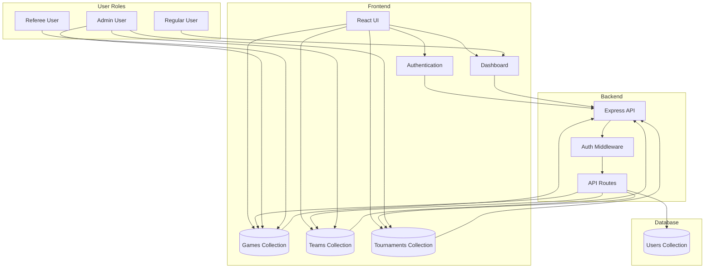
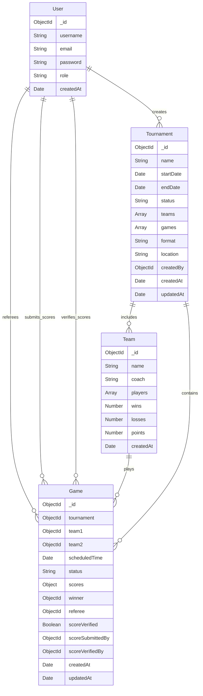

# Volleyball Tournament Management System


## Disclaimer

Made with Cursor IDE, an AI-powered IDE that helps you code faster and smarter. [Try Cursor IDE](https://cursor.so).

A MERN stack application for managing volleyball tournaments, including game scheduling, score tracking, and referee verification.

## Features

- Tournament dashboard with game schedules and scores
- User authentication and role-based access control
- Score submission and referee verification system
- Game scheduling interface for administrators
- Real-time updates for game status and scores

## Tech Stack

- MongoDB: Database
- Express.js: Backend framework
- React.js: Frontend framework
- Node.js: Runtime environment

## System Architecture



## Database Schema



## Prerequisites

- Node.js (v14 or higher)
- MongoDB
- npm or yarn

## Installation

1. Clone the repository
2. Install dependencies:
   ```bash
   npm run install-all
   ```
3. Create a `.env` file in the backend directory with the following variables:
   ```
   MONGODB_URI=your_mongodb_uri
   JWT_SECRET=your_jwt_secret
   PORT=5000
   ```
4. Create a `.env` file in the frontend directory:
   ```
   REACT_APP_API_URL=http://localhost:5000
   ```

## Running the Application

1. Start both frontend and backend:
   ```bash
   npm start
   ```
2. Or run them separately:
   - Backend: `npm run server`
   - Frontend: `npm run client`

## Project Structure

```
volleyball-tournament-app/
├── frontend/          # React frontend
├── backend/           # Express backend
└── package.json       # Root package.json
```

## License

ISC 
